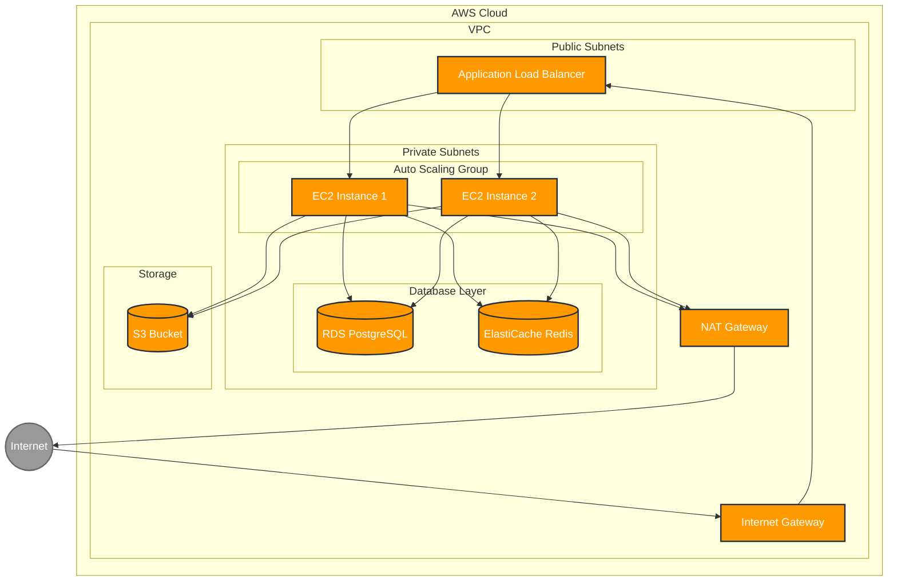

# Basic Cloud App - AWS CloudFormation Demo

This project demonstrates how to deploy a simple Python application on AWS using CloudFormation templates. It serves as a clear and modular example for infrastructure deployment using infrastructure-as-code.

## Architecture



The deployed infrastructure includes:

- VPC with public and private subnets across 2 Availability Zones
- Internet Gateway + optional NAT Gateway
- Security Groups following least privilege principle
- Auto Scaling Group with Launch Template
- Application Load Balancer (ALB)
- RDS PostgreSQL instance (Free Tier)
- ElastiCache Redis (Free Tier)
- S3 Bucket with versioning and termination protection

## Project Structure

```
.
├── app/                      # Application code
│   ├── app.py                # Simple Python HTTP server
│   └── user_data.sh          # EC2 user data script
├── infrastructure/           # CloudFormation resources
│   ├── parameters.json       # Stack parameters
│   └── templates/            # CloudFormation templates
│       ├── main.yml          # Main nested stack template
│       ├── network.yml       # Network infrastructure
│       ├── security.yml      # Security groups
│       ├── compute.yml       # EC2, ALB, ASG
│       ├── database.yml      # RDS, ElastiCache
│       └── storage.yml       # S3 resources
├── scripts/                  # Deployment scripts
│   ├── deploy.sh             # Stack deployment script
│   └── destroy.sh            # Stack deletion script
├── Makefile                  # Automation commands
└── README.md                 # Project documentation
```

## Prerequisites

- AWS CLI installed and configured with appropriate credentials
- AWS Key Pair for EC2 instance access
- Python 3.x (for local testing)

## Deployment Instructions

1. Update the parameters in `infrastructure/parameters.json` with your desired values:
   - Make sure to update `KeyPairName` with your actual EC2 key pair name
   - Set secure passwords for database access
   - Adjust instance types if needed (defaults are set to Free Tier eligible options)

2. Deploy the CloudFormation stack using the Makefile:

```bash
make deploy
```

This command will:
- Create an S3 bucket to store the CloudFormation templates
- Upload the templates to the S3 bucket
- Deploy the CloudFormation stack with all resources
- Output the stack resources when complete

3. To destroy the stack and cleanup all resources:

```bash
make destroy
```

## Testing the Deployment

After successful deployment, you can access the web application via the ALB DNS name, which is provided in the CloudFormation stack outputs.

```bash
# From the stack outputs
http://<ALB-DNS-Name>
```

## Local Testing

To test the Python application locally:

```bash
make run-local
```

The application will be available at http://localhost:8080

## CloudFormation Templates

The CloudFormation templates are organized in a modular structure:

- **network.yml**: VPC, subnets, internet gateway, NAT gateway, route tables
- **security.yml**: Security groups for ALB, EC2, RDS, and ElastiCache
- **storage.yml**: S3 bucket with security configurations
- **database.yml**: RDS PostgreSQL and ElastiCache Redis instances
- **compute.yml**: EC2 instances, launch template, Auto Scaling Group, and ALB
- **main.yml**: Main template that orchestrates all the nested stacks

## Notes

- All resources are configured to be within the AWS Free Tier limits where possible
- RDS and S3 have termination protection enabled to prevent accidental deletion
- The NAT Gateway is optional and can be disabled to reduce costs

## License

MIT
